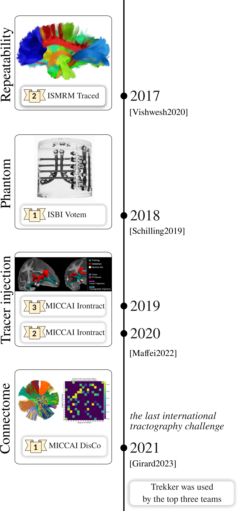

Awards
======

Tractography challenges
-----------------------

Pipelines using Trekker have earned awards in every international tractography competition organized since 2017, each featuring different themes.

Young scientist award
---------------------

Prior to Parallel Transport Tractography (PTT) [Aydogan2019]_, [Aydogan2021]_, Trekker was implementing an earlier version of the algorithm that was based on the Frenet-Serret frame [Aydogan2016]_. This work was ranked among the top five papers at MICCAI 2016, leading to a **Young Scientist Award**.

**References**

.. [Aydogan2016] `Aydogan DB, Shi Y. "Probabilistic tractography for topographically organized connectomes." In Medical Image Computing and Computer-Assisted Intervention–MICCAI 2016: 19th International Conference, Athens, Greece, October 17-21, 2016, Proceedings, Part I 19 2016 (pp. 201-209). Springer International Publishing. <https://link.springer.com/chapter/10.1007/978-3-319-46720-7_24>`__

.. [Aydogan2019] `Aydogan D.B., Shi Y., "A novel fiber tracking algorithm using parallel transport frames", Proceedings of the 27th Annual Meeting of the International Society of Magnetic Resonance in Medicine (ISMRM) 2019 <https://www.researchgate.net/publication/336847169_A_novel_fiber-tracking_algorithm_using_parallel_transport_frames>`__

.. [Aydogan2021] `Aydogan D.B., Shi Y., "Parallel transport tractography", in IEEE Transactions on Medical Imaging, vol. 40, no. 2, pp. 635-647, Feb. 2021, doi: 10.1109/TMI.2020.3034038. <https://ieeexplore.ieee.org/abstract/document/9239977/>`__

.. [Girard2023] `Girard, Gabriel, et al. "Tractography passes the test: Results from the diffusion-simulated connectivity (disco) challenge." NeuroImage 277 (2023): 120231. <https://www.sciencedirect.com/science/article/pii/S1053811923003828>`__

.. [Maffei2022] `Maffei, Chiara, et al. "Insights from the IronTract challenge: Optimal methods for mapping brain pathways from multi-shell diffusion MRI." NeuroImage 257 (2022): 119327. <https://www.sciencedirect.com/science/article/pii/S1053811922004463>`__

.. [Schilling2019] `Schilling, Kurt G., et al. "Limits to anatomical accuracy of diffusion tractography using modern approaches." Neuroimage 185 (2019): 1-11. <https://www.sciencedirect.com/science/article/pii/S1053811918319888?casa_token=TUClvAyGVXwAAAAA:b463jtW5LPR7WICue9kaob7-J61YbQxkUGuB_IoHnmqZn44k4sofRw1YSPRyVM_V2NM6-0xpTpKp>`__

.. [Vishwesh2020] `Nath, Vishwesh, et al. "Tractography reproducibility challenge with empirical data (TraCED): the 2017 ISMRM diffusion study group challenge." Journal of Magnetic Resonance Imaging 51.1 (2020): 234-249. <https://onlinelibrary.wiley.com/doi/abs/10.1002/jmri.26794>`__

