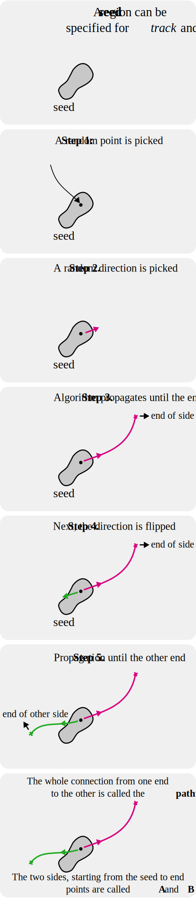

Pathways
========

Definitions
-----------

Trekker allows for a variety of pathway rules to apply anatomical constraints for fiber tracking and filtering. Before reading the rules in detail, please check the illustration below for definitions:

	When a seed is provided, Trekker regards each streamline to be composed of two sides, which are called **A** and **B**.

.. tip::

   - Trekker automatically determines the sides as **A** or **B** based on how they meet the user defined pathway rules, i.e., if the first side meets the criteria for **B** then Trekker assigns it as side **B**.
   - When a **seed** is not provided, rules with **_A** or **_B** options can not be used.
   - You can disable the default \"two-sided\" *tracking* or *filtering* by using the ``--oneSided`` option.

Rules
-----

Trekker offers powerful options for specifying pathway definitions. Rules can be defined using the ``--pathway`` option followed by one of the below rules:

- Require rules
   - **require_entry**: Pathway has to enter the region
   - **require_exit**: Pathway has to enter and then exit the region
   - **require_end_inside**: Pathway has to enter but can't exit the region

- Discard rules
   - **discard_if_enters**: Pathway can't enter the region
   - **discard_if_exits**:  Pathway can enter but can't exit the region
   - **discard_if_ends_inside**: Pathway can enter but can't end inside the region

- Stop rules (requires a *seed* to be defined first)
   - **stop_at_entry**: If a pathway enters the region, it will be truncated at the point of entry. The end point will be *precisely* the region border.
   - **stop_before_entry**: If a pathway is about to enter the region, it will be truncated just before it enters there. The end point will be outside the region.
   - **stop_after_entry**: If a pathway enters the region, it will be truncated just after it enters there. The end point will be inside the region.
   - **stop_at_exit**:  If a pathway exits the region, it will be truncated at the point of exit. The end point will be *precisely* the region border.
   - **stop_before_exit**: If a pathway is about to exit the region, it will be truncated just before it exit. The end point will still be inside the region.
   - **stop_after_exit**: If a pathway exits the region, it will be truncated just after it exits. The end point will be outside the region.

.. Note::

   **Why stop before / at / after?**

   - Trekker supports surface meshes for tracking and filtering.
   - A surface has a 2D boundary, which requires further considerations for tractography.

   **Example:**

   - Using the **stop_at_entry** rule, a whole-brain tractogram is obtained so that streamlines are truncated *exactly* at the white-matter gray-matter interface, defined with a surface mesh.

   **Question:** What happens when the user later wants to extract a specific fiber bundle using a portion of the same surface?

   **Answer:** In that case, some streamlines will follow the defined rule, but others will not. This occurs because the initial truncation places the end-point on the border with precision defined by float32 computations. Therefore, during a subsequent check, it is not guaranteed that the point will be recognized as being precisely on the surface. Providing the *before* and *after* options allows the user more flexibility for setting their rules.

**The rules can be further fine-tuned using the following options:**

- With ``--inOrder`` option is used, `require_entry` and `require_exit` rules are adhered to in the order that they are specified.

- Trekker supports the definition of seed regions for both *tracking* and *filtering*, using the ``--seed`` or ``-s`` options.

- When a seed is defined for *filtering*, all the streamlines are treated as if they were computed using that region as the seed. This means that if only a seed is provided without any other filtering option, the result is identical to the case where only the `require_entry` rule is defined.

- The following filtering features can only be used when a seed is defined:

   - **Side-specific filtering:** The above pathway rules can be defined separately for each side of the track, using `_A` and `_B` extensions, e.g., `require_entry_A` or `discard_if_ends_inside_B`. Here, the seed is considered to be somewhere between the end points A and B. If one of the pathway rules is defined using the `_A` or `_B` extensions, then all the other rules must also have an `_A` or `_B` extension.

   - **One-sided filtering:** The ``--oneSided`` option can only be used when pathway rules are not side-specific. When ``--oneSided`` is used, starting from the seed, only one side of the track is taken into account, the other side is ignored, and it will not appear in the output.

   - **Skipping seed:** The ``--skipSeed`` option can only be used together with ``--oneSided``. When ``--skipSeed`` is enabled, the output tracks only have one point that falls within the seed, and that point is one of the endpoints of the tracks.

   - **Using stop rules:** The `stop_at_entry` and `stop_at_exit` rules can only be used when a seed is defined.

Regions
-------

Trekker supports the following to be used together with the *seed* and *pathway rule* definitions:

- **Sphere:**
  e.g. ``-p require_entry 1.2,2.4,33.2,4`` defines a sphere using x,y,z,r notation.

- **Image files (.nii, .nii.gz):** The use of images are interpreted in six different ways:

  1. If only an integer type image is provided, as in ``img.nii``, then it is considered as a mask that is created by thresholding values above zero. During filtering, nearest neighbor interpolation is used.
  2. If only a floating type image is provided, as in ``img.nii``, then it is considered to provide partial volume fraction. A value above zero is considered inside, and during filtering, linear interpolation is used.
  3. If an image is provided followed by ``label``, as in ``img.nii label``, then it is considered as a mask that is created by thresholding values above zero. During filtering, nearest neighbor interpolation is used.
  4. If an image is provided followed by ``pvf``, as in ``img.nii pvf``, then it is considered to provide partial volume fraction. A value above zero is considered inside, and during filtering, linear interpolation is used.
  5. If an image is provided followed by ``label`` and an integer, as in ``img.nii label 1023``, then the provided integer value is considered as a label and a label image is created only using that value. During filtering, nearest neighbor interpolation is used.
  6. If an image is provided followed by ``pvf`` and an integer, as in ``img.nii pvf 0``, then it is considered that the input image is 4-dimensional, where the 4th dimension contains partial volume fractions, and the provided integer indicates the volume to use for filtering. A value above zero is considered inside, and during filtering, linear interpolation is used.

- **Surface files (.vtk, .gii):** The use of surfaces are interpreted in four different ways:

  1. If only the surface is provided, as in ``surf.vtk``, then if the surface is closed, the rule includes the interior of the surface; otherwise, only the surface is considered.
  2. If the surface is followed by x,y,z,r notation, as in ``surf.vtk 1.2,2.4,33.2,4``, then a disc centered at x,y,z with radius r is extracted, and an open surface is generated and considered for filtering.
  3. If the surface is followed by a string and an integer, as in ``surf.vtk label 3``, then the surface is considered to contain a field with the provided string. The integer is used as a label, which is used for filtering. For example, a surface containing labels for different parts of the brain can be used for filtering.
  4. If the surface is defined as in ``surf.vtk fileName VERT int 3``, then the fileName is considered to contain labels for each VERTex. The file contains 'int' (integer) data type, and the filtering should only consider VERTices with label 3.

  .. note::
     For fast filtering, Trekker first discretizes the surface meshes onto images. The default discretization resolution is 1. All the four options above can additionally provide the discretization value, which is considered to be the number that follows the input file, as in ``surf.vtk 0.4 fileName VERT int 3``, where 0.4 will be used to discretize the surface.
