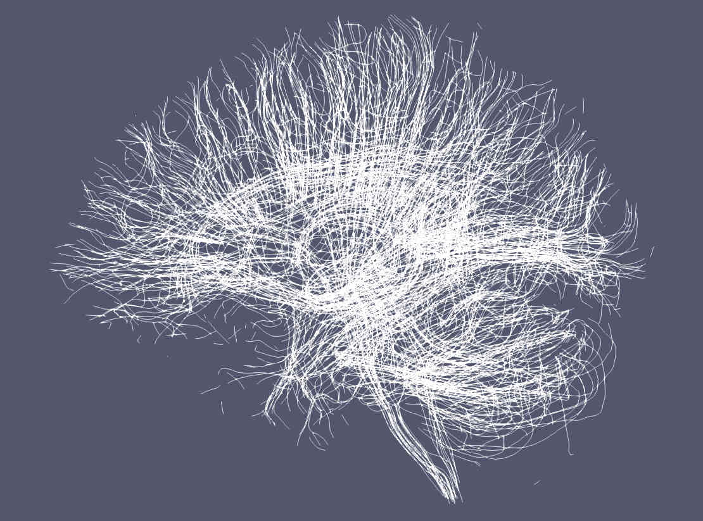
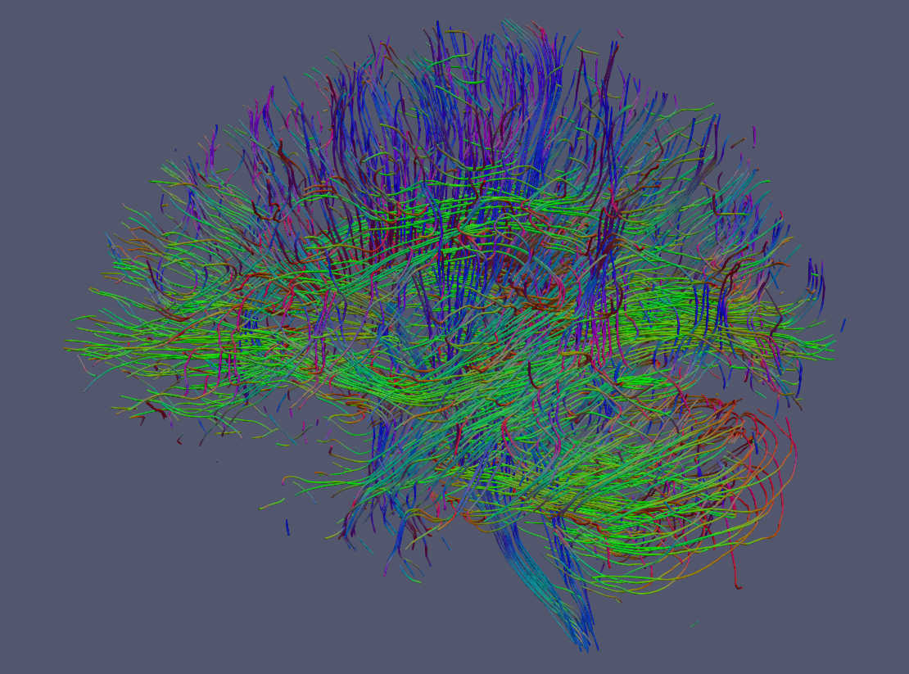

Tutorial 1: The short trek
==========================

Tracking with trekker
---------------------

Trekker does not have a graphical user interface. In order to use it, you need to run the :code:`trekker` executable in a terminal. Running :code:`trekker` alone shows the manual for the executable.

The example below shows probably the simplest approach to obtain a whole brain tractogram using trekker.

::

   # Tutorial 1 - Example 1
   ./trekker -fod FOD.nii.gz \                # Input FOD image
             -seed_image WHITEMATTER.nii.gz \ # Input seed image
             -seed_count 1000 \               # Number of random seeds to generate
             -output OUTPUT.vtk               # Output

Trekker options start with a \"-\" sign. All parameters and constraints are set using the corresponding option defined in the `manual <../manual/trekker.html>`__. The order of the options does not matter.

.. note::

	Trekker does not require input nifti files to be in the same image space, i.e., spatial dimensions of the FOD image can be 100x100x100 and the seed image can be 128x128x60. As long as images are in the same physical space (based on nifti sform), trekker will handle nifti files with different headers. This is valid also for images used to specify pathway rules.

Trekker sets all unspecified parameters to default values which are indicated in the `manual <../manual/trekker.html>`__; however the user must provide the following:

- **an FOD image**: specified with option **-fod**,

- **a seed image** or **a list of coordinates**: specified with either **-seed_image** or **-seed_coordinates**,

- **a seed count**, **seed count per voxel** or **-timeLimit**: if a seed image is specified, **-seed_count** or **-seed_countPerVoxel** options specify the number of streamlines to compute. Trekker generates 1 streamline per seed. If none of the two parameters were specified then **-timeLimit** option must be used to limit the duration of tracking. Tracking stops either when the required number of streamlines are reconstructed or the time limit is reached, whichever comes first. When tracking stops due to time limit, all the streamlines that are computed so far are written to the disk.

During tracking, trekker displays information on the terminal screen showing the parameters as well as the progress. At the end, an additional output with the same file name as output but with .json ending is saved. This file contains meta-information about the parameters and also the outcome of tracking process. The .json file can be opened using a web browser.

Visualizing results
-------------------

- Trekker saves tractograms in binary formatted **.vtk** files.

- All streamlines are saved in the physical coordinate space (based on sform fetched from the header of input FOD nifti).

- Trekker **.vtk** output can be read using Matlab with the function provided under :code:`extensions/matlab`.

- **.vtk** files can be visualized using several third party software including `Paraview <https://www.paraview.org/>`__, `3DSlicer <https://www.slicer.org/>`__ and `Qit <http://cabeen.io/qitwiki>`__.

Paraview interface is very simple to use and it provides professional 3D rendering capability. Trekker output can be visualized simply by dragging and dropping the **.vtk** file into Paraview window.

Below are examples drawn by Paraview using the trekker command shown in this tutorial applied on the Human Connectome Project subject 100307.

	Paraview by default renders streamlines using a solid (single) color.

.. figure:: tut1_1.jpg
	:scale: 50 %
	:alt: Paraview rendering 2

	It is possible to display tractograms in the familiar direction coded RGB scheme as shown here. With trekker you write the segment colors using the **-writeColors** option. Notice that by default colors are not written in order to save hard drive space. To show the segment colors, please select *colors* as the coloring option in Paraview and make sure that **Map Scalars** option is **NOT** selected.

.. seealso::
	Trekker can save many other information in the output that can be visualized in Paraview, such as the FOD amplitude along the direction of the segment with **-writeFODamp** option. You can view the other output options by clicking `here <../manual/trekker.html#output-options>`__.

	Streamlines can also be rendered as tubes with Paraview. For this option go to Filters->Search-> Write \"tube\" in the search box and click enter.
